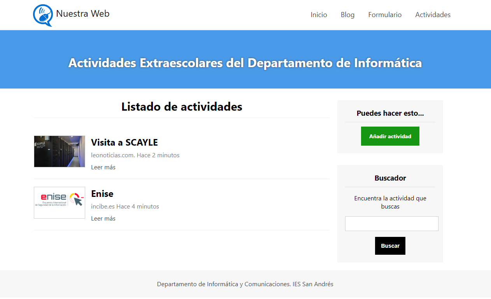

# U.T. 2.- USO DE ESTILOS

## PRÁCTICA 2. MAQUETAR UNA PÁGINA WEB

### Objetivo:
Realizar la maquetación de una página web sencilla utilizando estilos CSS en un fichero externo.

### Desarrollo:
Dado los archivos index.html, modificar el fichero styles.css para que el resultado tenga el siguiente aspecto:

El fichero `style.css` contiene las aclaraciones e indicaciones a tener en cuenta para su cumplimentación correcta.  
Personaliza el texto de “Actividades Extraescolares…” para que aparezca tu nombre y apellidos.  

Asegurate que no contiene ningún error de validación html ni css en  
- [https://validator.w3.org/](https://validator.w3.org/)
- [https://jigsaw.w3.org/css-validator](https://jigsaw.w3.org/css-validator/)

Se publicará la página mediante github.io 

### Evaluación:

Se entregará la url de github.io al aula virtual del Departamento de Informática del IES San Andrés
